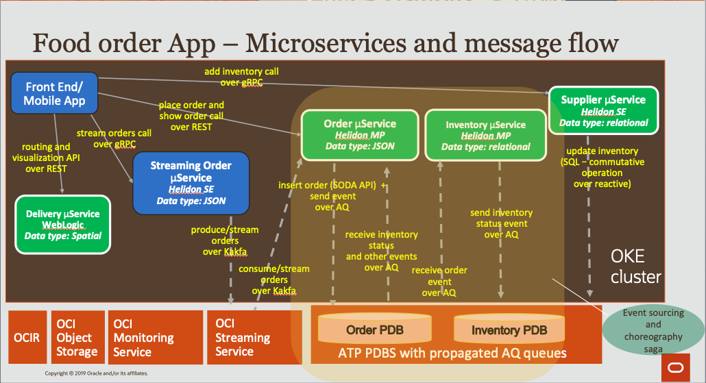
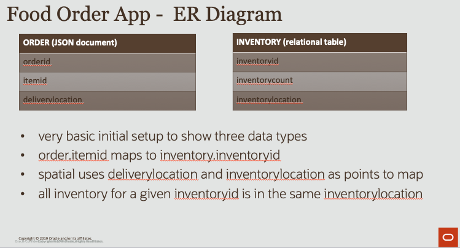

"Intelligent Event-driven Stateful Microservices with Helidon and Autonomous Database on OCI" 

 
 

Task 1 (Create OCI account, OKE cluster, ATP databases) 
   - Estimated task time 20 minutes
   - Video walk through: https://www.youtube.com/watch?v=0LeyGPw2vAA
   - Get (free) OCI account and tenancy 
        - https://myservices.us.oraclecloud.com/mycloud/signup
        - note tenancy ocid, region name, user ocid
   - Create user api key and note the private key/pem location, fingerprint, and passphrase 
        - https://docs.cloud.oracle.com/en-us/iaas/Content/Functions/Tasks/functionssetupapikey.htm
   - Create compartment
        - https://docs.cloud.oracle.com/en-us/iaas/Content/Identity/Tasks/managingcompartments.htm?Highlight=creating%20a%20comparment
        - https://oracle-base.com/articles/vm/oracle-cloud-infrastructure-oci-create-a-compartment#create-compartment
   - Create OCIR repos and auth key
        - Create a meaningful repos name such as `paul.parkinson/msdataworkshop`and note the repo-name you've created as it will be used in Task 4
        - https://docs.cloud.oracle.com/en-us/iaas/Content/Registry/Tasks/registrycreatingarepository.htm
   - Create OKE cluster
        - https://docs.cloud.oracle.com/en-us/iaas/Content/ContEng/Tasks/contengcreatingclusterusingoke.htm
        - https://docs.cloud.oracle.com/en-us/iaas/Content/ContEng/Tasks/contengaccessingclusterkubectl.htm
        - https://docs.cloud.oracle.com/en-us/iaas/Content/ContEng/Tasks/contengdownloadkubeconfigfile.htm
   - Create 2 ATP-S pdbs named `orderdb` and `inventorydb` (for order and all other services)
        - If the pdbs are not named `orderdb` and `inventorydb` the deployment yamls in the examples will need to be modified to use the names given.
        - Select the license included option for license.
        - https://docs.oracle.com/en/cloud/paas/autonomous-data-warehouse-cloud/tutorial-getting-started-autonomous-db/index.html 
        - Note the ocid, compartmentId, name, and admin pw of the databases
        - Download the regional wallet (connection info) and note the wallet password (this is optional depending on setup - todo elaborate)

Task 2 (Use Cloud Shell to access OKE cluster and create `msdataworkshop` namespace)
   - Estimated task time 2 minutes
   - Video walk through: https://www.youtube.com/watch?v=vYD1s6c3a8w
   - Enter Cloud Shell and issue command to export kubeconfig for the OKE cluster created
   - Related blog with quick instructions here: https://blogs.oracle.com/cloud-infrastructure/announcing-oracle-cloud-shell
   - Verify OKE access using command such as `kubectl get pods --all-namespaces`
   - Create `msdataworkshop` namespace using command `kubectl create ns msdataworkshop`
    
Task 3 (Create github account and build microservice image)
   - Estimated task time 2 minutes
   - Video walk through: https://www.youtube.com/watch?v=6g4c2yjbTPg
   - Optionally (if planning to make modifications, for example) 
        - Create github account if needed
        - Fork `https://github.com/paulparkinson/msdataworkshop.git` 
   - From Cloud Shell...
   - Run `git clone https://github.com/paulparkinson/msdataworkshop.git`
        - or if using a fork then `git clone` that fork instead
   - `cd msdataworkshop/frontend-helidon`
   - Run `mvn clean install`

Task 4 (Push image, deploy, and access microservice)
   - Estimated task time 8 minutes
   - Video walk through: https://www.youtube.com/watch?v=I10NLrAYjIM
   - From Cloud Shell...
   - Login to OCIR and verify docker
        - https://docs.cloud.oracle.com/en-us/iaas/Content/Registry/Tasks/registrypushingimagesusingthedockercli.htm
        - Run `docker login <region-key>.ocir.io -u <tenancy-namespace>/<username> -p <authtoken>` 
            - `<tenancy-namespace>` is the Object Storage Namespace found under tenancy information
            - example `docker login us-phoenix-1.ocir.io -u ax2mkasdfkkx/msdataworkshopuser -p Q:4qXo:7ADFaf9KZddZQ`
        - Verify with `docker image` command
   - For convenience, vi ~/.bashrc, append the following lines (substituting DOCKER_REGISTRY and MSDATAWORKSHOP_LOCATION values), and `source ~/.bashrc`

         export MSDATAWORKSHOP_LOCATION=~/msdataworkshop
         source $MSDATAWORKSHOP_LOCATION/shortcutaliases
         export PATH=$PATH:$MSDATAWORKSHOP_LOCATION/utils/
         export DOCKER_REGISTRY="<region-key>.ocir.io/<tenancy-namespace>/<repo-name>"
   - `cd $MSDATAWORKSHOP_LOCATION/frontend-helidon`
   - Run `./build.sh` to build the frontend-helidon image and push it to OCIR
   - Mark the image as public in OCIR via Cloud Shell (this avoids the need to do `docker login` in the deployment yaml or git CI/CD)
   - Run `./deploy.sh` to create deployment and service in the msdataworkshop namespace 
   - Check frontend pod is Running by using `kubectl get pods --all-namespaces` or the `pods` shortcut command
   - Check frontend loadbalancer address using `kubectl get services --all-namespaces`  or use `services` shortcut command
   - Access frontend page 
        - via frontend LoadBalancer service, eg http://129.146.99.99:8080
        - or, if the service has been modified to use NodePort instead of LoadBalancer...
            - `kubectl port-forward [frontend pod] -n msdataworkshop 8080:8080`
            - and access http://localhost:8080
   - Run `cd $MSDATAWORKSHOP_LOCATION ; ./build.sh ` to build and push all of the rest of the microservices
   - Mark all of the images as public in OCIR via Cloud Shell as done with the frontend image

Task 5 (Setup OCI Open Service Broker)
   - Estimated task time 5 minutes
   - Video walk through: https://www.youtube.com/watch?v=cb8N1TzNgsk
   - `cd $MSDATAWORKSHOP_LOCATION/osb-atp-and-oss`
   - Set ocid, etc. values in `setupOSB.sh` and run `./setupOSB.sh`
   - Refererences... 
        - https://github.com/oracle/oci-service-broker/blob/master/charts/oci-service-broker/docs/installation.md
        - https://www.youtube.com/watch?v=qW_pw6Nd5hM
   
Task 6 (Using OCI service broker, create binding to 2 existing ATP instances)
   - Estimated task time 5 minutes
   - Video walk through: https://www.youtube.com/watch?v=EGO-bLHrhv0
   - `cd $MSDATAWORKSHOP_LOCATION/osb-atp-and-oss`
   - Set ocid and password values in `setupATP.sh` and run `./setupATP.sh`
   - References...
        - https://github.com/oracle/oci-service-broker/blob/master/charts/oci-service-broker/docs/atp.md
        - https://www.youtube.com/watch?v=qW_pw6Nd5hM
  
Task 7 (Verify and understand ATP connectivity via Helidon microservice deployment in OKE)
   - Estimated task time 5 minutes
   - Video walk through: https://www.youtube.com/watch?v=k44qrpdohTM
   - Notice [atpaqadmin-deployment.yaml](atpaqadmin/atpaqadmin-deployment.yaml) wallet, secret, decode initcontainer, etc. 
   - Notice `atp*` references in [microprofile-config.properties](atpaqadmin/src/main/resources/META-INF/microprofile-config.properties) 
   - Notice @Inject dataSources in [ATPAQAdminResource.java](atpaqadmin/src/main/java/oracle/db/microservices/ATPAQAdminResource.java)
   - `cd $MSDATAWORKSHOP_LOCATION/atpaqadmin`
   - Run `./deploy.sh` to create deployment and service
   - Run `msdataworkshop` command to verify existence of deployment and service and verify pod is in Running state
   - Open the frontend microservice home page and hit the submit `testdatasources` button 
   - Troubleshooting... 
        - Look at logs... `kubectl logs [podname] -n msdataworkshop`
        - If no request is shown in logs, try accessing the pod directly using port-forward
            - `kubectl port-forward [atpadmin pod] -n msdataworkshop 8080:8080`
            - http://localhost:8080/test
            
Task 8 (Setup DB links between ATP PDBs, AQ, and Queue propagation, order and inventory, saga, and CQRS)...
   - Download connection information zip for ATP instances from console.
   - Upload cwallet.sso to objectstore, obtain and note pre-authorized URL for cwallet.sso
        - (this is for convenience, alternatively a DBMS_CLOUD.CREATE_CREDENTIAL can be used to create a credential that is then used to execute GET_OBJECT in PropagationSetup.java)
   - `cd $MSDATAWORKSHOP_LOCATION/atpaqadmin`
   - Edit `atpaqadmin-deployment.yaml` and provide values in the section marked with `PROVIDE VALUES FOR THE FOLLOWING...`
   - Run `kubectl delete -f atpaqadmin-deployment.yaml -n msdataworkshop`
   - Run `kubectl create -f atpaqadmin-deployment.yaml -n msdataworkshop`
   - Run `kubectl get pods -n msdataworkshop` and verify the atpaqadmin pod is in running state
   - Open the frontend microservice home page and hit the submit `setupAll` button 
                
Task 9 (Using OCI service broker, provision and create binding to stream, and verify with app)
   - demonstrate placeorder for choreography saga (success and fail/compensate)
   - demonstrate showorder for CQRS
   
Task 10 (Using OCI service broker, provision and create binding to stream, and verify with app)
   - Insure Task 4 is complete and refer to https://github.com/oracle/oci-service-broker and specifically...
        - https://github.com/oracle/oci-service-broker/blob/master/charts/oci-service-broker/docs/oss.md
   - In Cloud Shell and streaming policy
        - add a group for user if one does not exist
        - add policy for that group to allow streaming (eg name `StreamingPolicy`, description `Allow to manage streams`)
            - Policy statement `Allow group <SERVICE_BROKER_GROUP> to manage streams in compartment <COMPARTMENT_NAME>`
            - eg `Allow group msdataworkshop-admins to manage streams in compartment msdataworkshop-sandbox)`' 
   - todo... Currently hitting some issues with the following and resorting to manually setting 
   - cd to `oci-service-broker` directory such as oci-service-broker-1.3.3
   - `cp samples/oss/create-oss-instance.yaml create-oss-instance-order.yaml`
   - Modify `create-oss-instance-order.yaml` 
        - change name to `teststreamorder` provide compartmentID and specify `1` partition
   - Run `kubectl create -f create-oss-instance-order.yaml -n msdataworkshop`
   - `cp samples/oss/create-oss-binding.yaml create-oss-binding-order.yaml`
   - Modify `create-oss-binding-order.yaml` 
        - change name to `test-stream-binding-order` and change instanceRef name to `teststream-order'
   - Run `kubectl create -f create-oss-binding-order.yaml -n msdataworkshop`
   - Run `kubectl get secrets test-stream-binding-order -o yaml -n msdataworkshop`
   - Demonstrate streaming orders in frontend app by hitting `producerstream` button

Task 11 (Demonstrate health/readiness) 
   - eg order service is not ready until some data load (from view or eventsourcing or lazily) is done
   - show src and probes in deployment
   - https://kubernetes.io/docs/tasks/configure-pod-container/configure-liveness-readiness-startup-probes/
   - http://heidloff.net/article/implementing-health-checks-microprofile-istio
   - https://github.com/oracle/helidon/blob/master/docs/src/main/docs/health/02_health_in_k8s.adoc
   - https://github.com/oracle/helidon/blob/master/docs/src/main/docs/guides/07_health_se_guide.adoc
   - https://dmitrykornilov.net/2019/08/08/helidon-brings-microprofile-2-2-support/
    
Task 12 (Demonstrate OKE horizontal pod scaling)
   - install metrics-server
        - DOWNLOAD_URL=$(curl -Ls "https://api.github.com/repos/kubernetes-sigs/metrics-server/releases/latest" | jq -r .tarball_url)
        - DOWNLOAD_VERSION=$(grep -o '[^/v]*$' <<< $DOWNLOAD_URL)
        - curl -Ls $DOWNLOAD_URL -o metrics-server-$DOWNLOAD_VERSION.tar.gz
        - mkdir metrics-server-$DOWNLOAD_VERSION
        - tar -xzf metrics-server-$DOWNLOAD_VERSION.tar.gz --directory metrics-server-$DOWNLOAD_VERSION --strip-components 1
        - kubectl apply -f metrics-server-$DOWNLOAD_VERSION/deploy/1.8+/
   - kubectl get pods -n msdataworkshop |grep order-helidon
   - kubectl top pod order-helidon-74f848d85c-gxfq7 -n msdataworkshop --containers 
   - kubectl autoscale deployment order-helidon --cpu-percent=50 --min=1 --max=2 -n msdataworkshop
   - kubectl get hpa -n msdataworkshop
            NAME            REFERENCE                  TARGETS         MINPODS   MAXPODS   REPLICAS   AGE
            order-helidon   Deployment/order-helidon   <unknown>/50%   1         2         0          16s
   - increase cpu, notice cpu increase and scale to 2 pods

Future here to end...

(Demonstrate metrics prometheus and grafana (monitoring and alert)

(tracing)
   - install istio, demonstrate tracing (jaeger and kiali)
   - @Traced annotation
   
(LRA)

(security, vault, etc) 

(sharding)

(data flow) 
    - fully managed Spark service that lets you Run Spark applications with almost no administrative overhead.
    - for demo: fog computing of IoT
    
(data science)
    - enables data scientists to easily build, train, and manage machine learning models on Oracle Cloud, using Python and open source machine learning libraries
    - for demo: predictive analytics of orders to inventory/delivery locations

(data catalog)
    - enables data consumers to easily find, understand, govern, and track Oracle Cloud data assets across the enterprise using an organized inventory of data assets
    - what data is available where in the organization and how trustworthy and fit-for-use they are
    - for demo: analytics report of order info from streaming + atp 

